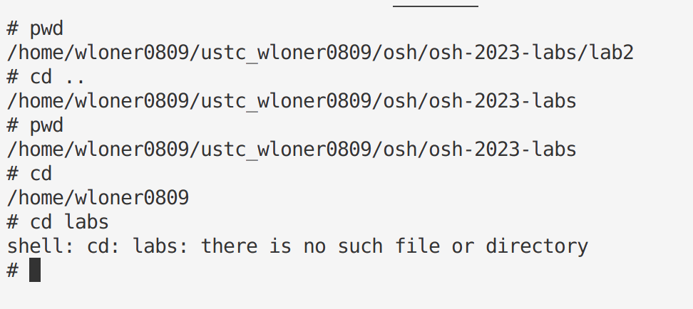
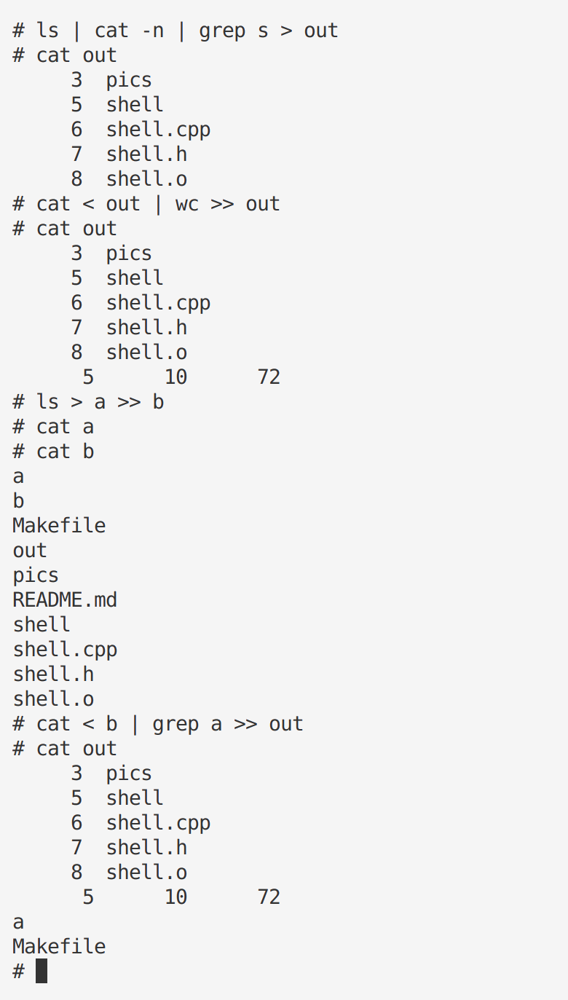
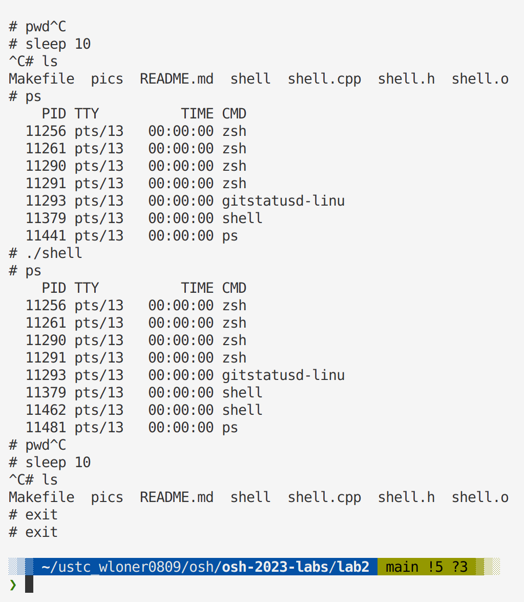
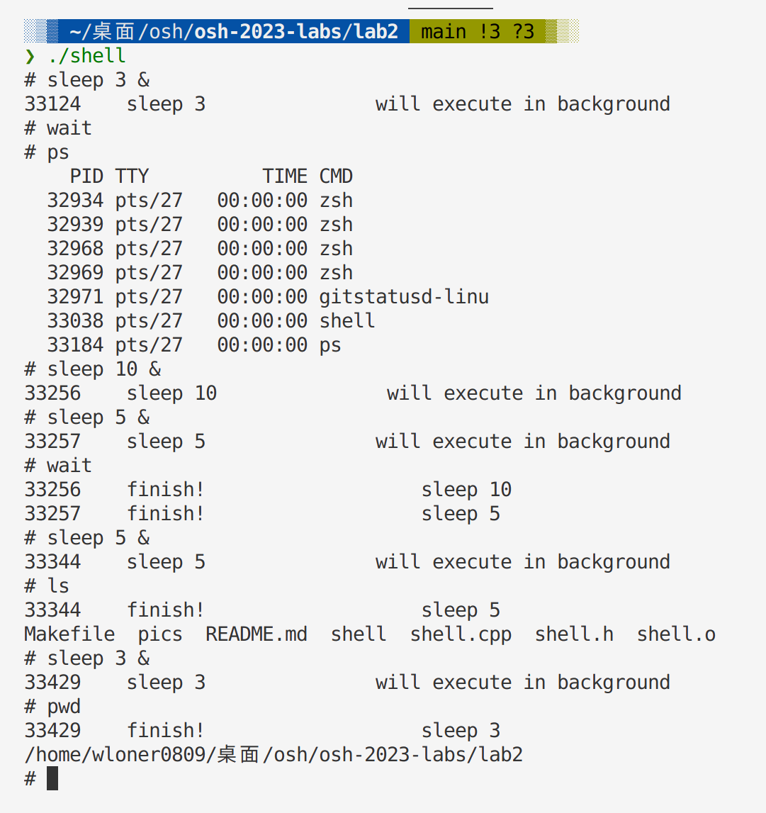
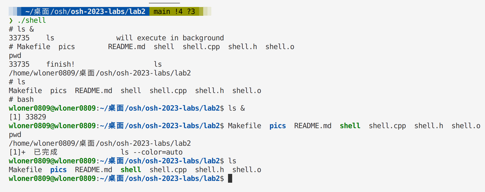

# Lab2

## Optional section
* `cd`在没有第二个参数时，默认进入家目录(5%)
* 支持`CTRL-D`(5%)
* `echo $SHELL`(5%)
* `echo ~root`(5%)
* 支持`history`(5%)
* 支持`alias`(5%)

## Test the function of each part
>  Actually, this section is used to provide examples about how shell executes in my computer.

* `Part1`

* `Part2 and Part3`

> Bash version:

> Attention: You should input just `one` space before and after "|" "<" ">" ">>"

> like " | "    " < "    " > "  " >> "

* `Part4`

> When stoping sleep cmd, "# " will output after "^C", which may be different from Bash. But it can just read instructions and execute correctly. So I think it's OK.

* `Part5`

